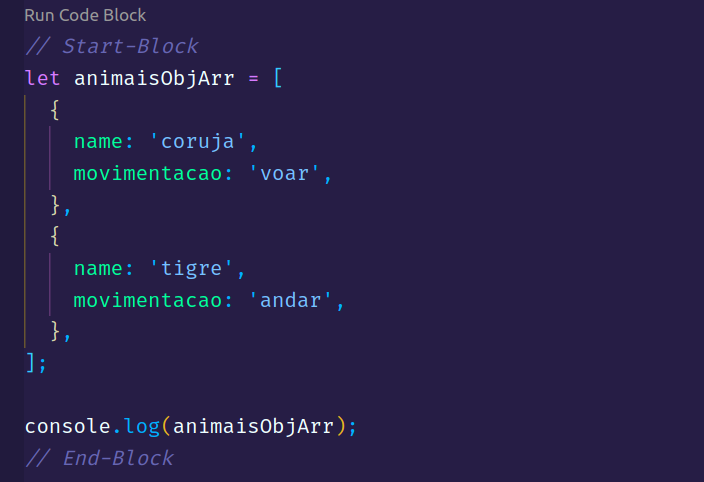
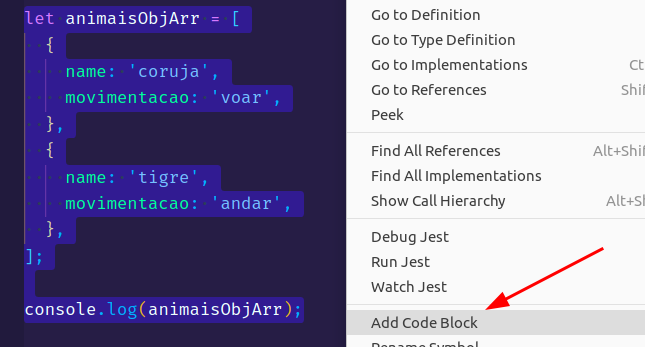

# Run Code Block README

This tool is for educational purposes, primarily for use in lectures.

## Features

Run the code between two comments using CodeLens.

> Tip: Use snippets or the context menu to generate the Start and End comments faster.

- **startcb**: `// Start-Block`.
- **endcb**: `// End-Block`.
- **codeblock**: Creates both at the same time.

## Requirements

> **vscode**: 1.66.0

## Supported Languages

- **Javascript** - [node](https://nodejs.org/en/)
- **Typescript** - [ts-node](https://www.npmjs.com/package/ts-node)

<!-- ## Known Issues

Calling out known issues can help limit users opening duplicate issues against your extension. -->

## Release Notes

### 1.0.0

Initial release of Run Code Block.

---

**Enjoy!**
